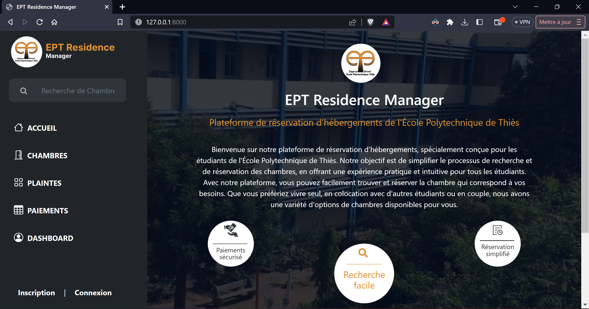
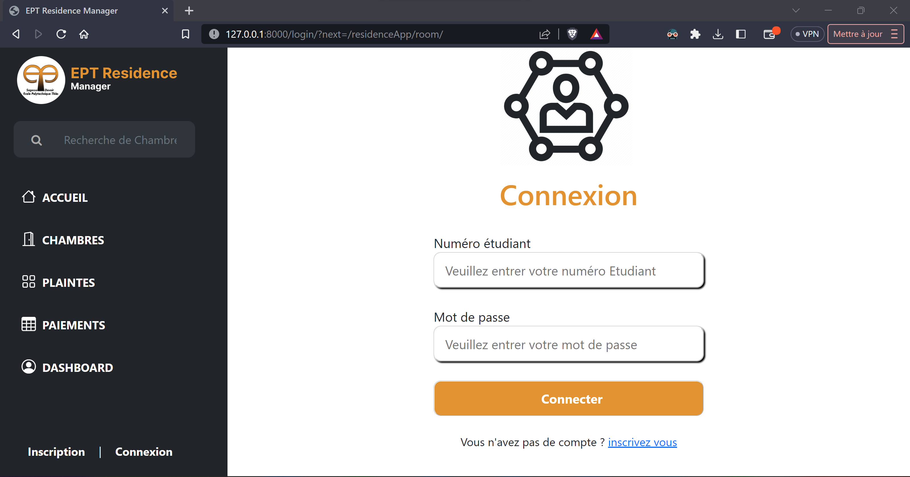
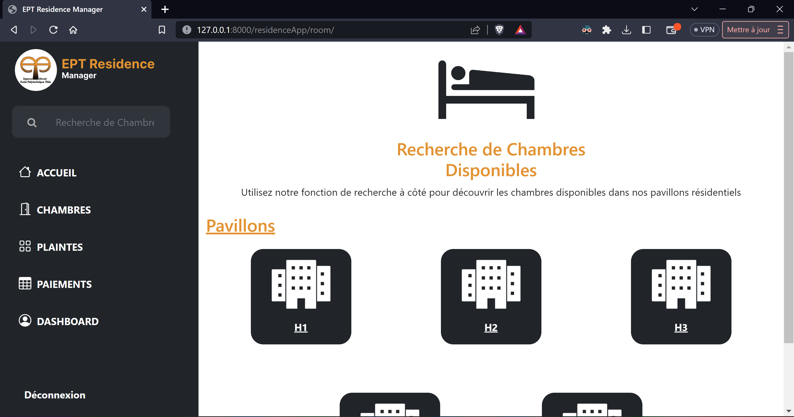

# residenceManager

Bienvenue sur le projet "Plateforme de Réservation d'Hébergements", spécialement conçu dans le cadre d'un projet de classe dédié au processus d'hébergement pour les étudiants de l'École Polytechnique de Thiès. L'objectif est de simplifier le processus de recherche et de réservation des chambres, tout en offrant une expérience pratique et intuitive à tous les étudiants.

### Quelques captures d'écran 

*Page d'accueil*

*Page de connexion*

*Page de réservation*

*Page de paiement*

## Comment Lancer le Projet

Suivez ces étapes pour lancer localement le projet sur votre machine :

### Prérequis

Assurez-vous d'avoir Python et Django installés sur votre système.

### Étapes

Lancez le serveur de développement Django :

python manage.py runserver
Accédez à l'application dans votre navigateur à l'adresse : http://127.0.0.1:8000/

C'est tout ! Vous devriez maintenant voir l'application en cours d'exécution sur votre machine.

---
Ce projet a été développé dans le cadre d'un projet de classe à l'École Polytechnique de Thiès.
[Mouhamadou Mansour Kholle-2023]

